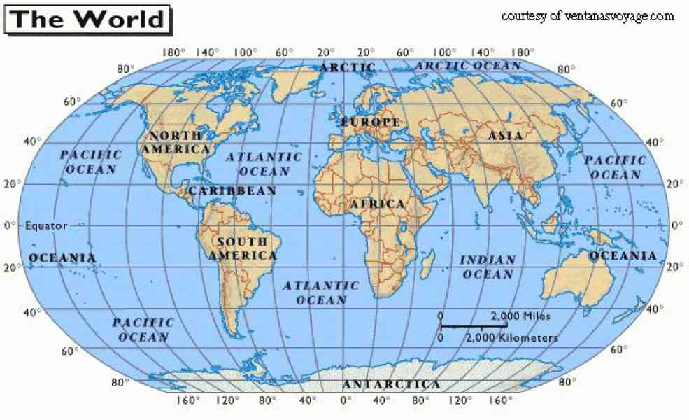
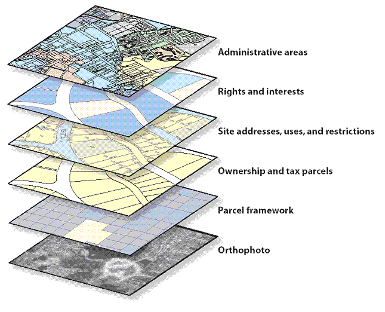

# Leaflet

## Menu

- [Les marqueurs](marker.md)
- [Filtre de carte](filter.md)
- [Dessiner des formes](shape.md)
- [Le routage](routing.md)

## Introduction à la cartographie

La terre étant spherique, il est difficile de l'applatir sans la déformer. Pour se faire on utilise une notion de projection.
Une projection, est une représentation de la terre traversée par des lignes verticales et horizontales avec des points représentants la longitude et la latitude comme système de coordonnées.

Il existe plusieurs [schémas de projections](https://fr.wikipedia.org/wiki/Liste_de_projections_cartographiques) et plusieurs système de coordonées.

Un point se repère par la disance à l'equateur (latitude) et la distance au méridien de Greenwich (longitude). La terre étant sphérique le système de coordonnées est basé sur un calcule d'angle.

Une système de carte est basé sur plusieurs couches :

- Couche de surface (fond de la carte, vecteur, photo satellite)
- Couche de lignes (routes, train)
- Couche toponymique (texte, pays, region, ville)
- Couche de surface (GeoJSON) contour de pays, regions, villes, zones
- Couche de marqueurs, dessins, informations (légendes)
- Couche interactive (popup, filtre, zoom)

